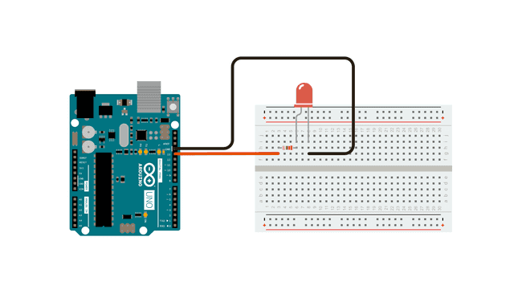
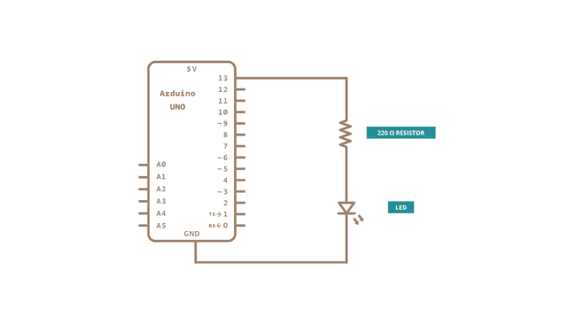

Blink com LED interno - Saída Digital
=====================================

Pisca LED interno
-----------------

Neste exemplo iremos aprender como ligar e desligar um LED.

Este costuma ser o exemplo mais simples. Não é preciso nenhum componente extra além da própria placa do Arduino. Todo o circuito necessário já vem inserido na própria placa.

Hardware necessário
-------------------

* 1 Placa de Arduino

Diagrama
--------

Sketch
-------

.. code-block:: c++

	void setup() {
	  // initialize digital pin LED_BUILTIN as an output.
	  pinMode(LED_BUILTIN, OUTPUT);
	}

	// the loop function runs over and over again forever
	void loop() {
	  digitalWrite(LED_BUILTIN, HIGH);  // turn the LED on (HIGH is the voltage level)
	  delay(1000);                      // wait for a second
	  digitalWrite(LED_BUILTIN, LOW);   // turn the LED off by making the voltage LOW
	  delay(1000);                      // wait for a second
	}

Esquema
-------

